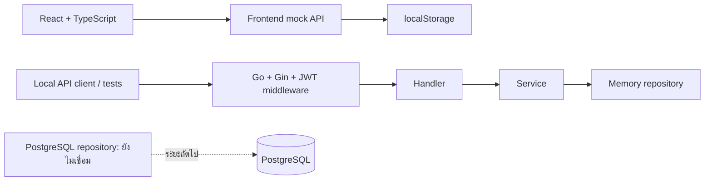
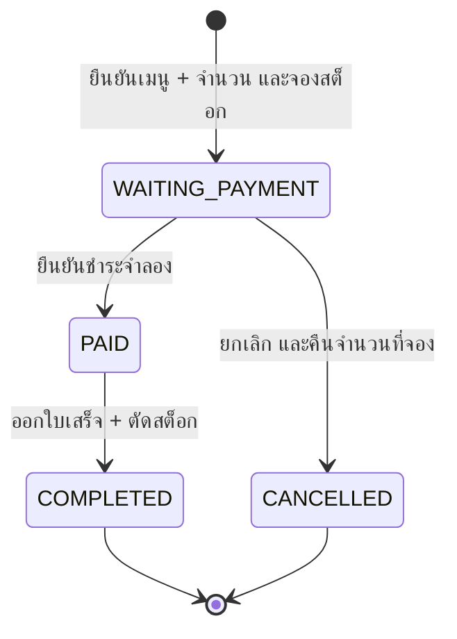

# สถาปัตยกรรมรุ่นทดลอง

ปัจจุบันแยกสองส่วนเพื่อให้ลอง UI ได้โดยไม่มี server:

ชั้น repository แบบหน่วยความจำใช้ mutex และ snapshot เพื่อ commit การเปลี่ยนแปลงทั้งหมดหรือไม่เปลี่ยนเลย
เมื่อมีหลาย request พร้อมกัน backend จึงไม่ขายเกินสต็อกหรือตัดสต็อกซ้ำ
Frontend ใช้การเปลี่ยน snapshot แบบ synchronous ภายในแท็บเดียว พร้อมเขียนลง localStorage
ทั้งสอง store มีข้อมูลตั้งต้นชนิดเดียวกัน แต่ไม่มีการ sync ข้ามกัน

## วงจรออเดอร์

PAID → ใบเสร็จ → ตัดสต็อก → COMPLETED อยู่ใน atomic operation เดียว
หากล้มเหลว state ยังคงเป็น WAITING_PAYMENT และไม่มี payment/receipt ที่สร้างค้างไว้
การเรียกชำระซ้ำกับ COMPLETED คืนใบเสร็จเดิม

จำนวนพร้อมขาย = สต็อกจริง − จำนวนในออเดอร์ WAITING_PAYMENT/PAID
สต็อกจริงเปลี่ยนเมื่อชำระสำเร็จหรือปรับจำนวนด้วยเหตุผลเท่านั้น
การแก้ราคา/ชื่อเมนูไม่เปลี่ยน snapshot ในออเดอร์ที่สร้างไปแล้ว

## ขั้นตอนระยะถัดไป

1. เปลี่ยน frontend API adapters เป็น HTTP และใช้ JWT จาก backend โดยใช้ contract ใน api.md
2. ย้ายการโหลดข้อมูลใน useShop ไปเป็น server state พร้อม loading/error/refetch และจัดการ token expiry
3. ทำ PostgreSQL repositories ด้วย SQL transactions/row locks พร้อม user audit fields และ migrations
4. เชื่อมผู้ให้บริการชำระเงินและตรวจผลจาก provider ก่อนเปลี่ยนสถานะ
5. เพิ่มข้อกำหนดภาษี/ส่วนลด/สิทธิ์ผู้ใช้/รายงานตามการใช้งานจริง แล้วค่อยเตรียม deployment

Docker Compose และ SQL ยังไม่ถูกเรียกใช้งานโดยโค้ดปัจจุบัน
